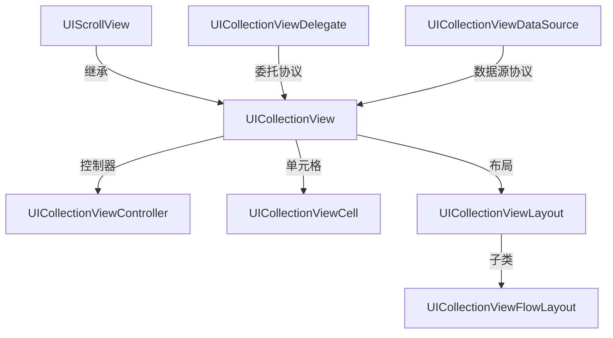

# 《iOS开发编程指南》读书杂记

## NSBundle

> A representation of the code and resources stored in a bundle directory on disk.

大致意思是bundle是一个目录，其中包含了程序会使用到的资源，这些资源包含了如图像，声音，编译好的代码，nib文件

## NSDictionary && NSMutableDictionary

### NSDictionary

> A static collection of objects associated with unique keys.

静态对象集合，不可变字典

### NSMutableDictionary

> A dynamic collection of objects associated with unique keys.

动态对象集合，可变字典

## NSLog

> Logs an error message to the Apple System Log facility.

将错误日志输出在苹果日志系统中

## 字符串与数组互转

``` Objective-C
// 字面量语法创建一个不可变数组
NSArray *arr = @[@“A",@"B",@"c",@"d"];
NSLog(@"%@", arr);

// 数组转换字符串
NSString *str = [arr componentsJoinedByString:@","];
NSLog(@"%@",str);

// 字符串转数组
NSArray *array = [str componentsSeparatedByString:@",'];
NSLog(@"%@",array);
```

## 集合视图类的构成

> UICollectionView继承自UIScrollView。与选择器类似，集合视图也有两个协议：UICollectionViewDelegate委托协议和UICollectionViewDataSource数据源协议。UICollectionViewCell是单元格类，它的布局是由UICollectionViewLayou类定义的，他是一个抽象类。UICollectionViewFlowLayout类是UICollectionViewLayout类的子类。对于复杂的布局，可以自定义UICollectionViewLayout类。UICollectionView对应的控制器是UICollectionViewController。



## 表视图类的构成
>
